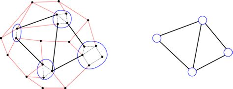

# Graph-Minor

<pre>
1st Assignment Parallel and distributed programming.
4page pdf report including:
-execution times of your implementations with respect to:
  1.the number of vertices n
  2.the number of edges m
  3.the number of clusters c
  4.the number of threads
-argue about the validity and effectiveness of your code
-cite external sources
-mention other important information 
</pre>

Prologue
--------
Gist of the problem
Adjacency Matrix (A):
Aij=1 if ijεE(G) (in other words if i and j are connected we mark 1 to the relative matrix element)
Aij=0 otherwise

If an element isn't 0 or 1, for example x, that could mean:
1.either that there are x edges connecting the two vertices
2.or that the edge between the two vertices is weighted and its value is x.

In the following example vertices a and b are connected with each other with two edges.
<pre>
                             a  b  c  d
a o-------------o b       a  0  2  1  0
  |\___________/|         b  2  0  0  1
  |             |         c  1  0  0  1
  |             |         d  0  1  1  0
c o-------------o d      
       Graph             Adjacency Matrix
</pre>

The sum of the row's ones from the adjacency matrix signify the **degree** (how many vertices 
is a particular vertex connected with) of the row's vertex.
The diagonal contains only zeros because a vertex cannot be adjacent to itself.
The matrix is symmetric across its diagonal.

Then we divide the graph's vectors into clusters, which are smaller graphs that, when combined, 
form the original complete graph. The graph minor is a graph that is made when we combine some
of the original graph's vertices into a clusterso that there exists an edge that it's virtices
belong to the same cluster.

Sparse matrices are matrices that mainly have '0' elements. This means we can represent them in
a smart way in order to save time not having to display every single '0' element. When we face
large matrices this notation can prove a very efficient way to represent the data.

<pre>
    a b c d 
  a 0 0 0 1        row     |a b b c d
  b 1 0 0 5       column   |d a d b d 
  c 0 8 0 0       values   |1 1 5 8 3 
  d 0 0 0 3         Representation
Sparse Matrix             
</pre>

Ω: If Ωij=1 then the node i belongs to the cluster j. Otherwise Ωij=0.
Transpose of a matrix is the swapping of the i and j coordinate of each element or the swapping
of the elements with regard to the diagonal.
Finally Graph minor-Matrix M: M = Ω(transpose) * A * Ω 

<pre>
a o-------o b
  | \   / |
  |  \ /  |
c o---o   o----o
      d   e    f
</pre>
 
Homework
--------
We are given the adjacency matrix (A) and the mapping vector (V) of a graph (G) and we are asked
to produce the Graph minor of G using parallel computing. 
<pre>
There will be 4 implementations:
1.Pthreads
2.OpenMp
3.OpenCilk
4.Julia
</pre>
to do:
how V works 
matrix market tutorial

External sources
----------------
<pre>
https://chat.openai.com
Adjacency Matrix: https://www.youtube.com/watch?v=7AhHGp7EzZ8
Graph Minors: https://www.youtube.com/watch?v=IJr8jXkGvX0
</pre>